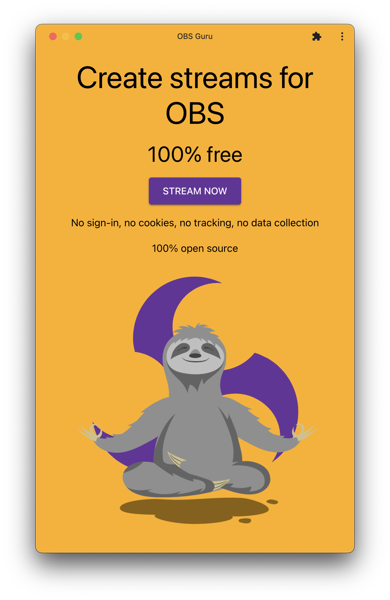

<h1>OBS Guru</h1>
<h2>A collection of tools to enhance your OBS streams</h2>
<h3>100% free</h3>
<h3>100% open source</h3>

No sign-in, no cookies, no tracking, no data collection.

<a href="https://www.obs.guru/" target="_blank">Open the app now</a>

<!-- toc -->

<!-- tocstop -->

## Features

- Screen sharing
  - Adjust resolution
  - share windows
  - share displays
  - share browser tabs
- Camera sharing
- Downloadable as progressive web app
